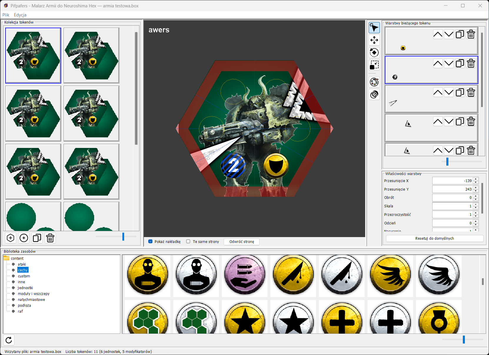
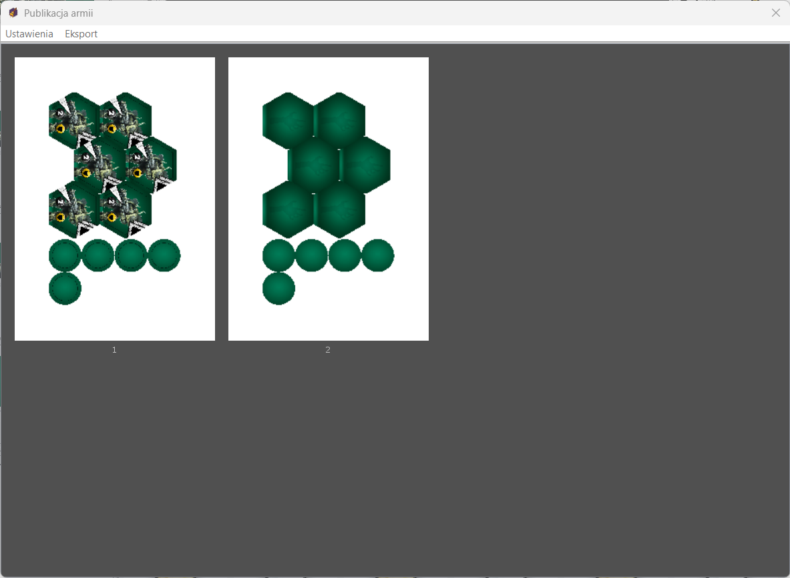

# Neuroshima Hex Army Editor

A minimalistic army painter for [Neuroshima HEX](https://boardgamegeek.com/boardgame/39570/neuroshima-hex). Compose custom tokens by stacking PNG image assets, tweak per-layer color/transform, and export print-ready PDFs.




## Quick start

```bash
./gradlew run        # dev run
./gradlew build      # compile + test
./gradlew release_all  # package for your OS (jpackage)
```

- **Kotlin / JVM 21**, Swing UI, `.box` JSON persistence (schema v3).
- **Ctrl+Z** undo, **Ctrl+Y** redo, **Ctrl+S** save, **Ctrl+P** publish.
- Unit + integration tests via `./gradlew test`.

Use together with [Ojkiejpojki](https://github.com/TheBadOgre/ojkipojki) — a minimalistic tabletop simulator to test armies over the internet.

See [AGENTS.md](AGENTS.md) for full architecture guide.
